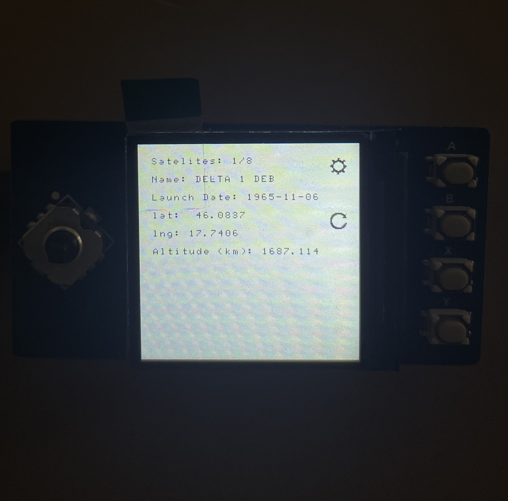

# raspberry-pico-n2yo-api
This Raspberry Pico MicroPython script retrieves satellite data from the n2yo.com API and displays it on the Waveshare Pico LCD 1.3 screen. Use the left and right buttons to cycle through satellites. Press the settings button (A) to view the settings screen, which never finished so there are no settings just the concept of it. The refresh button (B) makes another API call. This is limited to 40 seconds per call, and the remaining time before the next possible call is displayed (n2yo lets you call the above API 100 times an hour, 40k ms is safe)

## HOW TO USE
- open the py file in Thonny
- type in your wifi ssid and password in the respective variables
- change te location data in the base_settings variable to your (or any other) lat;lng;elevation
- put in your n2yo API key (you have to register there then generate API key here: https://www.n2yo.com/login/edit/)
- run it on your Raspberry Pico W with the LCD 1.3 by Waveshare attached

If everything went well you should see satelite data based on the location.

Since there are thousands of satellites above you at any given moment, the API call is limited to 10 degrees of the sky. This way, it tells you about five to fifteen of them, as the Raspberry Pi Pico cannot hold more data than that. You can try increasing the angle in the wonderfully ugly formated string ```response = requests.get(f"{api_url}/{settings[0]}/{settings[1]}/{settings[2]}/10/0?api_key=api_key")``` line. You can see the 10 near the end of the line.




## OTHER INFO
I used a small PHP script to identify the non-transparent pixel positions in the icon's PNG versions to insert the cog and refresh icons. This way, I don't have to store the images anywhere on the Pico, and I have a small function that draws them wherever I want.
